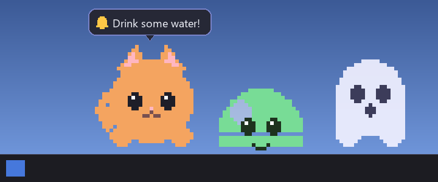
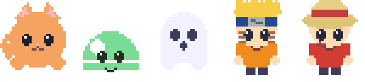

# Desktop Pet

A lightweight, customizable **desktop mascot for Windows** — a tiny pixel-art
character that sits, walks, naps, and falls along the top of your taskbar.
Pick it up and drop it, swap characters, resize it, and let it quietly keep you
company while using almost no system resources.



> Five characters ship with the app — a **cat**, a **slime**, a **ghost**, plus
> two original chibi fan-art mascots: **Naruto** and **Luffy**.



---

## Features

- **Truly transparent** — per-pixel alpha, no window frame, no taskbar button,
  no Alt-Tab entry. Just the character floats on your desktop.
- **Lives on the taskbar** — automatically detects the taskbar position
  (bottom / top / left / right) and DPI. Rests right on top of it.
- **Hides on fullscreen** — automatically disappears when a game, fullscreen
  video, or slideshow is in front. Reappears when you return to the desktop.
- **Smooth sprite animations** — idle, walking, sleeping, and falling, driven
  by a frame-rate-independent animation engine.
- **A little brain** — randomly idles, wanders left/right, or naps. Edge
  detection keeps it from walking off the screen.
- **Drag & drop** — left-click and drag the pet anywhere. Let go and it falls
  back down to the taskbar under gravity.
- **Personality speech bubbles** — each character has its own lines and randomly
  pipes up with wellness nudges like *"Drink some water!"* or *"Posture check!"*
- **Emotions** — pat it (happy), shake it (angry), drop it hard (sad). Each
  triggers a matching mood icon and personality line.
- **Reminders** — set a daily time and message. The pet pops a bubble to remind
  you. Add, disable, or delete from the menu.
- **Modern dark menu** — clean, rounded right-click menu and reminder dialog.
  Also available from the system-tray icon.
- **Five characters** — cat, slime, ghost, Naruto, and Luffy (original chibi
  pixel art). Add your own by dropping a folder of PNG frames.
- **Import tool** — turn any GIF or sprite sheet into a character automatically.
- **Adjustable size and speed**, remembered between runs.
- **Retro sound effects** — synthesized blips for grabbing, walking, landing,
  and napping. Toggle with Mute in the menu.
- **Low CPU and memory** — one small window, one ~30 FPS timer. The paint loop
  is just a pixmap blit.

---

## Setup

### 1. Requirements

- Windows 10 or 11
- Python 3.9+ from [python.org](https://www.python.org/downloads/) — tick
  **"Add Python to PATH"** during install

### 2. Install dependencies

```bat
pip install -r requirements.txt
```

`PyQt5` is the only runtime dependency. `Pillow` is optional and only needed for
the tools in `tools/`.

### 3. Run

```bat
python main.py
```

Or double-click **`run.bat`** to start with no console window.

### 4. Build a standalone `.exe` (optional)

Want to run without Python, or share it?

```bat
build_exe.bat
```

This produces a single portable file — **`dist\DesktopPet.exe`** — with all
characters and assets bundled inside. Move it anywhere and double-click it. No
Python needed. On first run it extracts editable `characters\` and `assets\`
folders next to itself.

> To auto-start at login: press `Win+R`, type `shell:startup`, and drop a
> shortcut to `DesktopPet.exe` in that folder.

---

## Controls

| Action | How |
| --- | --- |
| Move it | Left-click and drag |
| Drop it | Release — it falls to the taskbar |
| Pat it (happy) | Quick click without moving it |
| Annoy it (angry) | Shake it back and forth while dragging |
| Hard drop (sad) | Drop it from high up |
| Make it talk | Right-click → **Say something** |
| Open menu | Right-click the pet or its tray icon |
| Change character | Menu → **Change character** |
| Resize | Menu → **Size** (Tiny / Small / Medium / Large) |
| Speed | Menu → **Speed** (Slow / Normal / Fast / Turbo) |
| Add a reminder | Menu → **Reminders** → **Add reminder…** |
| Mute | Menu → **Mute / Unmute** |
| Quit | Menu → **Exit** |

Settings (character, size, speed, mute) are saved to `settings.json`.
Reminders are saved to `reminders.json`. Both are restored on next run.

---

## Messages, personality, and emotions

Every character chatters from its own `config.json`, grouped by mood:

- **`idle`** — random chatter and wellness nudges, shown every 30–70 seconds
  while idle or walking.
- **`happy`** — triggered by a quick pat (click without dragging).
- **`angry`** — triggered by shaking the pet while dragging.
- **`sad`** — triggered by a hard drop from a height.
- **`surprised`** / **`sleepy`** — shown on a bump or when lying down.

Each character has its own voice:

| Character | Personality | Sample line |
| --- | --- | --- |
| Cat | Lazy and sassy | *"Feed me, human."* |
| Slime | Wholesome and encouraging | *"You're doing amazing!"* |
| Ghost | Spooky but caring | *"Don't stay up too late..."* |
| Naruto | Energetic, never-give-up ninja | *"Believe it!"* |
| Luffy | Adventure-loving pirate captain | *"I'm gonna be King of the Pirates!"* |

Edit any character's `messages` in its `config.json` to give it your own voice.

> The Naruto and Luffy sprites are **original chibi pixel art** inspired by the
> characters, not official artwork, so the project stays free to share.

---

## Reminders

Right-click → **Reminders** → **Add reminder…**, pick a time, type a message
(e.g. `Drink water`). The pet pops a bubble with a bell at that time every day.
Manage reminders (enable, disable, delete) from the same submenu.

---

## Adding your own characters

A character is a folder inside `characters/`:

```
characters/
└── mychar/
    ├── config.json        optional — sensible defaults are used
    ├── idle/              required — frame_00.png, frame_01.png, ...
    ├── walk/              optional
    ├── sleep/             optional
    ├── fall/              optional
    └── sounds/            optional — walk.wav, land.wav, grab.wav, sleep.wav
```

Frames are PNGs named `frame_00.png`, `frame_01.png`, etc., played in order
and looped. Any missing animation falls back to `idle`. Pixel art is upscaled
with nearest-neighbour so it stays crisp, but any PNG size works.

Restart the app and the character appears in **Change character**.

### Import a GIF or sprite sheet

```bat
:: Each GIF becomes one animation state:
python tools/import_media.py --name mychar --state idle --gif idle.gif
python tools/import_media.py --name mychar --state walk  --gif run.gif

:: Horizontal sprite sheet of 4 frames:
python tools/import_media.py --name mychar --state walk --sheet run.png --cols 4

:: Grid sheet + key out a white background:
python tools/import_media.py --name mychar --state idle --sheet sheet.png ^
    --fw 64 --fh 64 --bg "#ffffff" --tolerance 30
```

The tool auto-crops transparent borders and writes a starter `config.json`.
Edit that file to add a name, personality, and message lines.

> Use art you have the right to use. Official anime/game sprites are copyrighted
> — fine for personal/offline use, but do not redistribute them.

### `config.json` reference

```json
{
  "name": "My Character",
  "personality": "A short description of this character's vibe.",
  "fps": { "idle": 6, "walk": 10, "sleep": 3, "fall": 8 },
  "scale": 2.5,
  "walk_speed": 38,
  "behavior": {
    "idle_min": 2.0,
    "idle_max": 6.0,
    "walk_chance": 0.55,
    "sleep_chance": 0.2
  },
  "messages": {
    "idle":      ["Drink some water!", "Don't forget to stretch~"],
    "happy":     ["Yay!"],
    "angry":     ["Hey! Stop that!"],
    "sad":       ["Ouch..."],
    "surprised": ["!"],
    "sleepy":    ["Zzz..."]
  },
  "sounds": {
    "walk":  "walk.wav",
    "land":  "land.wav",
    "grab":  "grab.wav",
    "sleep": "sleep.wav"
  }
}
```

| Key | Meaning |
| --- | --- |
| `name` | Display name in the menu |
| `personality` | Free-text note (not shown in-app, useful for editing) |
| `fps` | Playback speed per animation state |
| `scale` | Base size multiplier (global size setting applies on top) |
| `walk_speed` | Pixels per second while walking |
| `behavior.idle_min/max` | Seconds to stay idle before deciding what to do next |
| `behavior.walk_chance` | Probability of walking after idling |
| `behavior.sleep_chance` | Probability of napping after idling |
| `messages` | Lines per mood: `idle`, `happy`, `angry`, `sad`, `surprised`, `sleepy` |
| `sounds` | `.wav` filenames in `sounds/` for each event |

### Regenerating the bundled art and sounds

```bat
python tools/generate_sprites.py    :: pixel-art frames + config (with messages)
python tools/generate_sounds.py     :: synthesized .wav effects
python tools/generate_emotes.py     :: shared mood icons
```

---

## Project structure

```
desktop pet/
├── main.py                 entry point
├── run.bat                 double-click launcher (no console)
├── build_exe.bat           build a standalone DesktopPet.exe
├── requirements.txt
├── pet/
│   ├── paths.py            file paths — works as script or frozen .exe
│   ├── config.py           load/save settings
│   ├── taskbar.py          Win32 taskbar position + fullscreen detection
│   ├── animation.py        sprite-frame animation player
│   ├── character.py        loads a character folder
│   ├── behavior.py         idle/walk/sleep/fall/drag state machine
│   ├── bubble.py           floating speech bubble
│   ├── emotes.py           mood-icon loader + menu stylesheet
│   ├── reminders.py        reminder storage + add-reminder dialog
│   ├── sound.py            non-blocking sound effects
│   └── pet_widget.py       transparent window + emotions + menu + tray
├── characters/
│   ├── cat/
│   ├── slime/
│   ├── ghost/
│   ├── naruto/
│   └── luffy/
├── assets/
│   ├── icon.ico
│   └── emotes/             mood icons: happy, angry, sad, surprised, music, bell
├── tools/
│   ├── generate_sprites.py
│   ├── generate_sounds.py
│   ├── generate_emotes.py
│   └── import_media.py
└── docs/
    ├── preview.png
    └── characters.png
```

---

## How it works

- **Transparency** — a frameless `QWidget` with `WA_TranslucentBackground` and
  `Qt.Tool | WindowStaysOnTopHint`. Only the sprite is painted.
- **Taskbar detection** — `SHAppBarMessage(ABM_GETTASKBARPOS)` via ctypes.
  Re-checked every two seconds to handle auto-hide and resolution changes.
- **Fullscreen detection** — compares the foreground window rect to the monitor
  rect once per second. Hides and restores the pet accordingly.
- **Animation** — frames pre-scaled once at load (with a cached flipped copy for
  direction). A single `QTimer` advances them by delta-time.
- **Behaviour** — a finite state machine: `idle → walk / sleep`, plus `fall` and
  `drag`. Gravity on the fall; impact triggers an emotion.
- **Speech bubbles** — a second tiny frameless window. Auto-hides after a few
  seconds.

---

## Troubleshooting

| Problem | Fix |
| --- | --- |
| `ModuleNotFoundError: PyQt5` | Run `pip install -r requirements.txt` |
| "No characters found" | Run `python tools/generate_sprites.py` |
| Pet disappeared | Normal when a **fullscreen** app is active. Returns when you go back to the desktop. |
| No sound | Check Mute is off in the menu and system volume is up. If `sounds/` folders are empty, run `python tools/generate_sounds.py`. |
| No tray icon | Harmless. Right-click the pet itself to open the menu. |

---

## License

Free to use, modify, and share. The bundled pixel art and sounds are generated
by the included scripts, so they are yours to remix too.
